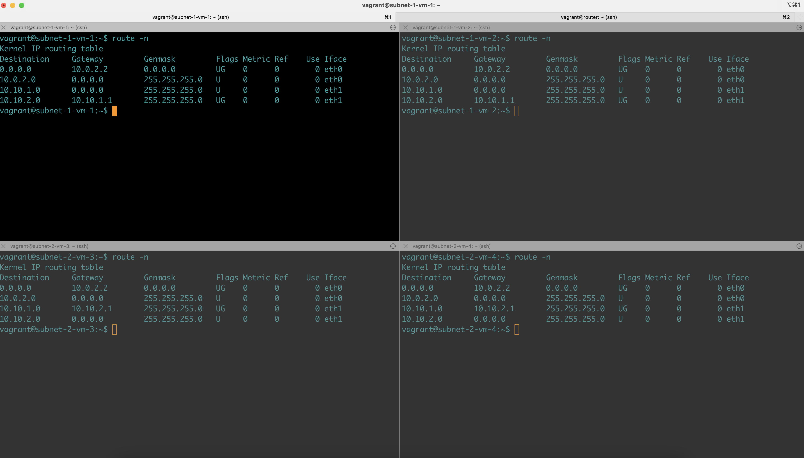
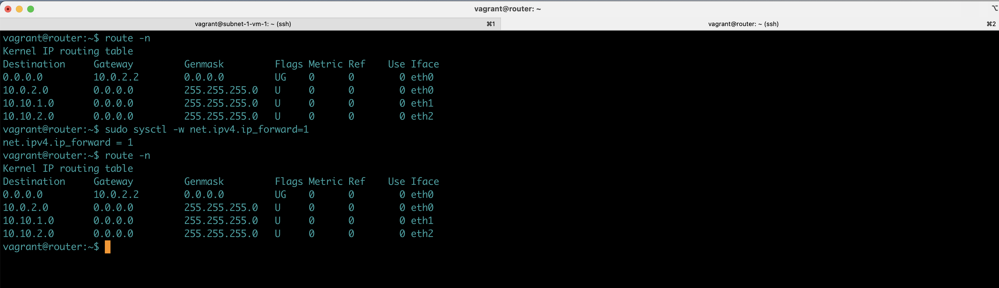

# network-basics

## Step-1

```
git clone git@github.com:sinhasonalkumar/network-basics.git

```
## Step-2

### Open a terminal

```
cd subnets-routing-intersubnet-intrasubnet/router

```

```
vagrant up

```

```
vagrant ssh

```

## Step-3

### Open a terminal

```
cd subnets-routing-intersubnet-intrasubnet/subnet-1/subnet-1-vm-1

```

```
vagrant up

```

```
vagrant ssh

```

## Step-4

### Open a terminal

```
cd subnets-routing-intersubnet-intrasubnet/subnet-1/subnet-1-vm-2

```

```
vagrant up

```

```
vagrant ssh

```


## Step-5

### Open a terminal

```
cd subnets-routing-intersubnet-intrasubnet/subnet-2/subnet-2-vm-3

```

```
vagrant up

```

```
vagrant ssh

```


## Step-6

### Open a terminal

```
cd subnets-routing-intersubnet-intrasubnet/subnet-2/subnet-2-vm-4

```

```
vagrant up

```

```
vagrant ssh

```

## Step-7

### Check Connectivity inter subnet and intra subnet

### Go To each vm and run following commands. You will see, only inter-subnet connectivity works and intera-subnet connectivity will not work. But from router VM all pings will work as it two NIC/interfaces connecting to both networks/subnets. 

```
ip addr 
```

```
arp 
```
```
route -n 
```

```
ping 10.10.1.11

```

```
ping 10.10.1.12

```

```
ping 10.10.1.1

```

```
ping 10.10.2.1

```

```
ping 10.10.2.23

```

```
ping 10.10.2.24

```

## Step-8

### Configure route

### Go to subnet-1-vm-1 vm

```
route -n
```
```
sudo route add -net 10.10.2.0 netmask 255.255.255.0 gw 10.10.1.1 dev eth1
```

```
route -n
```


## Step-9

### Configure route

### Go to subnet-1-vm-2 vm

```
route -n
```
```
sudo route add -net 10.10.2.0 netmask 255.255.255.0 gw 10.10.1.1 dev eth1
```

```
route -n
```


## Step-10

### Configure route

### Go to subnet-2-vm-3 vm

```
route -n
```
```
sudo route add -net 10.10.1.0 netmask 255.255.255.0 gw 10.10.2.1 dev eth1
```

```
route -n
```


## Step-11

### Go to router vm

```
ip addr 
```

```
arp 
```
```
route -n 
```

```
ping 10.10.1.11

```

```
ping 10.10.1.12

```

```
ping 10.10.1.1

```

```
ping 10.10.2.1

```

```
ping 10.10.2.23

```

```
ping 10.10.2.24

```

## Step-12

### Repeat Step-7. 

 `Even through routes are all good in all hosts including router, uou will still see the same behavior except router vm is now reachable on both networks. This is because router vm is not forwarding the packets. So we have to convert linux host to router host.`


### Go to router vm. And the under-noted command to convert linux host to linux router by enabling packet forwarding.

```
sudo sysctl -w net.ipv4.ip_forward=1
```

## Step-13

### Repeat Step-7. 

Now both intra subnet pings also starts working via router. And inter-subnet pings was already working. So we have full connectivity.


## Routes Screenshots

### Routes On VM



### Routes On Router

